<h1 align="center">
  <strong>
    100-DAYS-OF-PYTHON-PRO<br>BOOTCAMP
  </strong>
</h1>

<p align="center"><i>Master Python Skills, Build Your Future Today</i></p>

<p align="center">
  
  
  
</p>

<br/>

<p align="center"><i>Built with the tools and technologies:</i></p>

<p align="center">
  
  
</p>

Welcome! I'm **Avinash**, and this repository documents my learning journey through the **[100 Days of Code: Python Bootcamp by Dr. Angela Yu](https://www.udemy.com/course/100-days-of-code/)**.
## 🎯 **Mission Statement**

> **"Code every day, build every project, master every concept"**
> 
> This repository chronicles my complete transformation through Dr. Angela Yu's legendary Python Bootcamp - from writing my first `print("Hello World!")` to deploying full-stack web applications.

## 🗂️ Folder Structure

```100-Days-of-Python-Code-challenge/
├── Day 001/
├── Day 002/
├── Day 003/
├── Day 004/
├── Day 005/
├── ...
├── Day 100/
└── README.md
```

## MY PROGRESS


---
## 📊 **Learning Path Visualization**

```mermaid
graph TD
    A[🎯 Day 1: Hello Python] --> B[🎮 Beginner Projects]
    B --> C[🏗️ Intermediate Development]
    C --> D[🚀 Advanced Applications]
    D --> E[💼 Portfolio Projects]
    
    B --> B1[🎲 Games & Logic]
    B --> B2[🔤 Text Processing]
    
    C --> C1[🌐 Web Scraping]
    C --> C2[🖼️ GUI Applications]
    C --> C3[📊 Data Handling]
    
    D --> D1[🌍 Flask Web Apps]
    D --> D2[📈 Data Science]
    D --> D3[🤖 Automation]
    
    E --> E1[🎨 Creative Projects]
    E --> E2[💡 Capstone Builds]
```



---

# 100 Days of Code: Python Pro Bootcamp - Day-by-Day Overview

This table details the daily progression of Dr. Angela Yu's "100 Days of Code: The Complete Python Pro Bootcamp" on Udemy, grouped by thematic/skill-level categories. Beginner and Intermediate Python sections are subdivided into smaller thematic groups. Each day includes topics, projects, and GitHub links.

# 100 Days of Python Pro Bootcamp

A comprehensive Python learning journey from beginner to advanced, organized into collapsible sections for easy navigation.

---

<details>
<summary><strong>🐣 Beginner Python (Days 1–14)</strong></summary>

## Core Basics (Days 1–4)

Fundamental Python concepts for absolute beginners.

| Day   | Topic/Project         | Description                        | GitHub Link                                                                                       |
| ----- | --------------------- | ---------------------------------- | ------------------------------------------------------------------------------------------------- |
| Day 1 | Variables             | Python intro, variables, `print()` | [Day 001](https://github.com/AvinashNegi1999/100-Days-of-Python-Pro-Bootcamp/tree/main/Day%20001) |
| Day 2 | Data Types & Strings  | Numbers, strings, type conversion  | [Day 002](https://github.com/AvinashNegi1999/100-Days-of-Python-Pro-Bootcamp/tree/main/Day%20002) |
| Day 3 | Control Flow          | If/else, comparison operators      | [Day 003](https://github.com/AvinashNegi1999/100-Days-of-Python-Pro-Bootcamp/tree/main/Day%20003) |
| Day 4 | Randomization & Lists | Random module, lists, indexing     | [Day 004](https://github.com/AvinashNegi1999/100-Days-of-Python-Pro-Bootcamp/tree/main/Day%20004) |

## Control Flow & Loops (Days 5–8)

Building logic with conditionals, loops, and functions.

| Day   | Topic/Project           | Description                            | GitHub Link                                                                                       |
| ----- | ----------------------- | -------------------------------------- | ------------------------------------------------------------------------------------------------- |
| Day 5 | For Loops               | Iterate lists, `range()` function      | [Day 005](https://github.com/AvinashNegi1999/100-Days-of-Python-Pro-Bootcamp/tree/main/Day%20005) |
| Day 6 | While Loops & Functions | While loops, basic functions           | [Day 006](https://github.com/AvinashNegi1999/100-Days-of-Python-Pro-Bootcamp/tree/main/Day%20006) |
| Day 7 | Project: Hangman        | Build Hangman with loops, conditionals | [Day 007](https://github.com/AvinashNegi1999/100-Days-of-Python-Pro-Bootcamp/tree/main/Day%20007) |
| Day 8 | Function Parameters     | Positional/keyword arguments           | [Day 008](https://github.com/AvinashNegi1999/100-Days-of-Python-Pro-Bootcamp/tree/main/Day%20008) |

## Data Structures & Scope (Days 9–14)

Working with dictionaries, scope, and larger projects.

| Day    | Topic/Project           | Description                           | GitHub Link                                                                                       |
| ------ | ----------------------- | ------------------------------------- | ------------------------------------------------------------------------------------------------- |
| Day 9  | Dictionaries            | Dictionaries, nesting, methods        | [Day 009](https://github.com/AvinashNegi1999/100-Days-of-Python-Pro-Bootcamp/tree/main/Day%20009) |
| Day 10 | Functions with Outputs  | Return statements, multiple returns   | [Day 010](https://github.com/AvinashNegi1999/100-Days-of-Python-Pro-Bootcamp/tree/main/Day%20010) |
| Day 11 | Project: Blackjack      | Build Blackjack with loops            | [Day 011](https://github.com/AvinashNegi1999/100-Days-of-Python-Pro-Bootcamp/tree/main/Day%20011) |
| Day 12 | Scope & Number Guessing | Local/global scope, guessing game     | [Day 012](https://github.com/AvinashNegi1999/100-Days-of-Python-Pro-Bootcamp/tree/main/Day%20012) |
| Day 13 | Debugging               | Find/fix errors, use `print()`        | [Day 013](https://github.com/AvinashNegi1999/100-Days-of-Python-Pro-Bootcamp/tree/main/Day%20013) |
| Day 14 | Project: Higher Lower   | Compare follower counts, conditionals | [Day 014](https://github.com/AvinashNegi1999/100-Days-of-Python-Pro-Bootcamp/tree/main/Day%20014) |

</details>

---

<details>
<summary><strong>🚀 Intermediate Python (Days 15–30)</strong></summary>

## OOP & Turtle Graphics (Days 15–23)

Object-oriented programming and graphical projects with Turtle.

| Day    | Topic/Project            | Description                          | GitHub Link                                                                                       |
| ------ | ------------------------ | ------------------------------------ | ------------------------------------------------------------------------------------------------- |
| Day 15 | Development Environment  | Set up Python, PyCharm, PEP8         | [Day 015](https://github.com/AvinashNegi1999/100-Days-of-Python-Pro-Bootcamp/tree/main/Day%20015) |
| Day 16 | OOP Introduction         | Classes, objects, methods            | [Day 016](https://github.com/AvinashNegi1999/100-Days-of-Python-Pro-Bootcamp/tree/main/Day%20016) |
| Day 17 | OOP: Classes & Objects   | Construct objects, access attributes | [Day 017](https://github.com/AvinashNegi1999/100-Days-of-Python-Pro-Bootcamp/tree/main/Day%20017) |
| Day 18 | Turtle Graphics          | Basic graphics, shapes with Turtle   | [Day 018](https://github.com/AvinashNegi1999/100-Days-of-Python-Pro-Bootcamp/tree/main/Day%20018) |
| Day 19 | Turtle: Events & State   | Handle inputs, manage Turtle state   | [Day 019](https://github.com/AvinashNegi1999/100-Days-of-Python-Pro-Bootcamp/tree/main/Day%20019) |
| Day 20 | Project: Snake Game      | Start Snake game with Turtle, OOP    | [Day 020](https://github.com/AvinashNegi1999/100-Days-of-Python-Pro-Bootcamp/tree/main/Day%20020) |
| Day 21 | Project: Snake Game      | Add movement, collision to Snake     | [Day 021](https://github.com/AvinashNegi1999/100-Days-of-Python-Pro-Bootcamp/tree/main/Day%20021) |
| Day 22 | Project: Pong Game       | Two-player Pong with Turtle          | [Day 022](https://github.com/AvinashNegi1999/100-Days-of-Python-Pro-Bootcamp/tree/main/Day%20022) |
| Day 23 | Project: Turtle Crossing | Road-crossing game with Turtle       | [Day 023](https://github.com/AvinashNegi1999/100-Days-of-Python-Pro-Bootcamp/tree/main/Day%20023) |

## File I/O & GUI (Days 24–30)

File handling, Tkinter GUI, and related projects.

| Day    | Topic/Project             | Description                              | GitHub Link                                                                                       |
| ------ | ------------------------- | ---------------------------------------- | ------------------------------------------------------------------------------------------------- |
| Day 24 | Files & Paths             | File I/O, read/write files, paths        | [Day 024](https://github.com/AvinashNegi1999/100-Days-of-Python-Pro-Bootcamp/tree/main/Day%20024) |
| Day 25 | Project: U.S. States      | Guess U.S. states with CSV, Turtle       | [Day 025](https://github.com/AvinashNegi1999/100-Days-of-Python-Pro-Bootcamp/tree/main/Day%20025) |
| Day 26 | List Comprehensions       | Advanced list operations, comprehensions | [Day 026](https://github.com/AvinashNegi1999/100-Days-of-Python-Pro-Bootcamp/tree/main/Day%20026) |
| Day 27 | Tkinter GUI               | Tkinter basics, GUI elements             | [Day 027](https://github.com/AvinashNegi1999/100-Days-of-Python-Pro-Bootcamp/tree/main/Day%20027) |
| Day 28 | Project: Pomodoro Timer   | Pomodoro timer with Tkinter              | [Day 028](https://github.com/AvinashNegi1999/100-Days-of-Python-Pro-Bootcamp/tree/main/Day%20028) |
| Day 29 | Project: Password Manager | Password manager with Tkinter, I/O       | [Day 029](https://github.com/AvinashNegi1999/100-Days-of-Python-Pro-Bootcamp/tree/main/Day%20029) |
| Day 30 | Error Handling            | Try/except, exception handling           | [Day 030](https://github.com/AvinashNegi1999/100-Days-of-Python-Pro-Bootcamp/tree/main/Day%20030) |

</details>

---

<details>
<summary><strong>🌐 Web Scraping & Automation (Days 31–53)</strong></summary>

APIs, web scraping with Beautiful Soup, browser automation with Selenium.

| Day    | Topic/Project              | Description                             | GitHub Link                                                                                       |
| ------ | -------------------------- | --------------------------------------- | ------------------------------------------------------------------------------------------------- |
| Day 31 | Project: Flash Card App    | Flash card app with Tkinter, CSV        | [Day 031](https://github.com/AvinashNegi1999/100-Days-of-Python-Pro-Bootcamp/tree/main/Day%20031) |
| Day 32 | Email Automation           | Send emails with `smtplib`, datetime    | [Day 032](https://github.com/AvinashNegi1999/100-Days-of-Python-Pro-Bootcamp/tree/main/Day%20032) |
| Day 33 | APIs Introduction          | API requests, `requests`, JSON          | [Day 033](https://github.com/AvinashNegi1999/100-Days-of-Python-Pro-Bootcamp/tree/main/Day%20033) |
| Day 34 | Project: ISS Tracker       | Track ISS with APIs, notifications      | [Day 034](https://github.com/AvinashNegi1999/100-Days-of-Python-Pro-Bootcamp/tree/main/Day%20034) |
| Day 35 | Project: Rain Alert        | SMS rain alert with weather APIs        | [Day 035](https://github.com/AvinashNegi1999/100-Days-of-Python-Pro-Bootcamp/tree/main/Day%20035) |
| Day 36 | Project: Stock Alert       | Fetch stock prices, news alerts         | [Day 036](https://github.com/AvinashNegi1999/100-Days-of-Python-Pro-Bootcamp/tree/main/Day%20036) |
| Day 37 | Project: Habit Tracker     | Habit tracker with Pixela API           | [Day 037](https://github.com/AvinashNegi1999/100-Days-of-Python-Pro-Bootcamp/tree/main/Day%20037) |
| Day 38 | Project: Workout Tracker   | Workout tracking with Google Sheets     | [Day 038](https://github.com/AvinashNegi1999/100-Days-of-Python-Pro-Bootcamp/tree/main/Day%20038) |
| Day 39 | Project: Flight Finder     | Start flight deal finder with APIs      | [Day 039](https://github.com/AvinashNegi1999/100-Days-of-Python-Pro-Bootcamp/tree/main/Day%20039) |
| Day 40 | Project: Flight Club       | Complete flight deal app, notifications | [Day 040](https://github.com/AvinashNegi1999/100-Days-of-Python-Pro-Bootcamp/tree/main/Day%20040) |
| Day 41 | HTML Basics                | HTML tags, structure, basic webpages    | [Day 041](https://github.com/AvinashNegi1999/100-Days-of-Python-Pro-Bootcamp/tree/main/Day%20041) |
| Day 42 | Intermediate HTML          | HTML forms, tables, semantic elements   | [Day 042](https://github.com/AvinashNegi1999/100-Days-of-Python-Pro-Bootcamp/tree/main/Day%20042) |
| Day 43 | CSS Basics                 | Inline, internal, external CSS          | [Day 043](https://github.com/AvinashNegi1999/100-Days-of-Python-Pro-Bootcamp/tree/main/Day%20043) |
| Day 44 | Project: Personal Site     | Stylized personal website with CSS      | [Day 044](https://github.com/AvinashNegi1999/100-Days-of-Python-Pro-Bootcamp/tree/main/Day%20044) |
| Day 45 | Web Scraping: Movies       | Scrape top 100 movies, Beautiful Soup   | [Day 045](https://github.com/AvinashNegi1999/100-Days-of-Python-Pro-Bootcamp/tree/main/Day%20045) |
| Day 46 | Project: Spotify Playlist  | Create playlist with Spotify API        | [Day 046](https://github.com/AvinashNegi1999/100-Days-of-Python-Pro-Bootcamp/tree/main/Day%20046) |
| Day 47 | Project: Amazon Tracker    | Track prices with Beautiful Soup        | [Day 047](https://github.com/AvinashNegi1999/100-Days-of-Python-Pro-Bootcamp/tree/main/Day%20047) |
| Day 48 | Selenium Basics            | Browser automation with Selenium        | [Day 048](https://github.com/AvinashNegi1999/100-Days-of-Python-Pro-Bootcamp/tree/main/Day%20048) |
| Day 49 | Project: LinkedIn Jobs     | Automate job applications with Selenium | [Day 049](https://github.com/AvinashNegi1999/100-Days-of-Python-Pro-Bootcamp/tree/main/Day%20049) |
| Day 50 | Project: Tinder Swiper     | Auto-swiper with Selenium               | [Day 050](https://github.com/AvinashNegi1999/100-Days-of-Python-Pro-Bootcamp/tree/main/Day%20050) |
| Day 51 | Project: Twitter Bot       | Automate Twitter complaints, Selenium   | [Day 051](https://github.com/AvinashNegi1999/100-Days-of-Python-Pro-Bootcamp/tree/main/Day%20051) |
| Day 52 | Project: Instagram Bot     | Automate Instagram follows, Selenium    | [Day 052](https://github.com/AvinashNegi1999/100-Days-of-Python-Pro-Bootcamp/tree/main/Day%20052) |
| Day 53 | Project: Scraping Capstone | Advanced scraping with Selenium, Soup   | [Day 053](https://github.com/AvinashNegi1999/100-Days-of-Python-Pro-Bootcamp/tree/main/Day%20053) |

</details>

---

<details>
<summary><strong>💻 Web Development (Days 54–70)</strong></summary>

Flask, databases, authentication, and web app deployment.

| Day    | Topic/Project           | Description                               | GitHub Link                                                                                       |
| ------ | ----------------------- | ----------------------------------------- | ------------------------------------------------------------------------------------------------- |
| Day 54 | Flask Introduction      | Flask basics, routing, templates          | [Day 054](https://github.com/AvinashNegi1999/100-Days-of-Python-Pro-Bootcamp/tree/main/Day%20054) |
| Day 55 | Flask: Advanced Routing | URL parameters, dynamic routes            | [Day 055](https://github.com/AvinashNegi1999/100-Days-of-Python-Pro-Bootcamp/tree/main/Day%20055) |
| Day 56 | Project: Name Card Site | Simple Flask website with templates       | [Day 056](https://github.com/AvinashNegi1999/100-Days-of-Python-Pro-Bootcamp/tree/main/Day%20056) |
| Day 57 | Flask: Jinja Templates  | Jinja2 templating, dynamic HTML           | [Day 057](https://github.com/AvinashNegi1999/100-Days-of-Python-Pro-Bootcamp/tree/main/Day%20057) |
| Day 58 | Project: Blog Site      | Start Flask blog with templates           | [Day 058](https://github.com/AvinashNegi1999/100-Days-of-Python-Pro-Bootcamp/tree/main/Day%20058) |
| Day 59 | Project: Blog Site      | Add styling, posts to Flask blog          | [Day 059](https://github.com/AvinashNegi1999/100-Days-of-Python-Pro-Bootcamp/tree/main/Day%20059) |
| Day 60 | Flask: Forms & POST     | Handle forms, POST requests in Flask      | [Day 060](https://github.com/AvinashNegi1999/100-Days-of-Python-Pro-Bootcamp/tree/main/Day%20060) |
| Day 61 | Project: Flask Login    | Login system with Flask, forms            | [Day 061](https://github.com/AvinashNegi1999/100-Days-of-Python-Pro-Bootcamp/tree/main/Day%20061) |
| Day 62 | Project: Cafe & Wifi    | Flask site with database integration      | [Day 062](https://github.com/AvinashNegi1999/100-Days-of-Python-Pro-Bootcamp/tree/main/Day%20062) |
| Day 63 | SQLite Databases        | SQLite, basic queries, Python integration | [Day 063](https://github.com/AvinashNegi1999/100-Days-of-Python-Pro-Bootcamp/tree/main/Day%20063) |
| Day 64 | Project: Movie Database | Movie database app with SQLite            | [Day 064](https://github.com/AvinashNegi1999/100-Days-of-Python-Pro-Bootcamp/tree/main/Day%20064) |
| Day 65 | Web Design Principles   | UX/UI basics for web apps                 | [Day 065](https://github.com/AvinashNegi1999/100-Days-of-Python-Pro-Bootcamp/tree/main/Day%20065) |
| Day 66 | Project: RESTful API    | Build REST API with Flask                 | [Day 066](https://github.com/AvinashNegi1999/100-Days-of-Python-Pro-Bootcamp/tree/main/Day%20066) |
| Day 67 | Project: Blog with API  | Add REST API to Flask blog                | [Day 067](https://github.com/AvinashNegi1999/100-Days-of-Python-Pro-Bootcamp/tree/main/Day%20067) |
| Day 68 | Authentication in Flask | User authentication, login systems        | [Day 068](https://github.com/AvinashNegi1999/100-Days-of-Python-Pro-Bootcamp/tree/main/Day%20068) |
| Day 69 | Project: Auth Blog      | Add authentication to Flask blog          | [Day 069](https://github.com/AvinashNegi1999/100-Days-of-Python-Pro-Bootcamp/tree/main/Day%20069) |
| Day 70 | Deploying Flask Apps    | Deploy Flask app to Heroku                | [Day 070](https://github.com/AvinashNegi1999/100-Days-of-Python-Pro-Bootcamp/tree/main/Day%20070) |

</details>

---

<details>
<summary><strong>📊 Data Science & Machine Learning (Days 71–80)</strong></summary>

Data analysis, visualization, and introductory machine learning.

| Day    | Topic/Project             | Description                              | GitHub Link                                                                                       |
| ------ | ------------------------- | ---------------------------------------- | ------------------------------------------------------------------------------------------------- |
| Day 71 | Pandas Introduction       | Pandas for data manipulation, DataFrames | [Day 071](https://github.com/AvinashNegi1999/100-Days-of-Python-Pro-Bootcamp/tree/main/Day%20071) |
| Day 72 | Pandas: Data Cleaning     | Remove NaN, duplicates, convert types    | [Day 072](https://github.com/AvinashNegi1999/100-Days-of-Python-Pro-Bootcamp/tree/main/Day%20072) |
| Day 73 | Project: Data Exploration | Explore datasets with Pandas             | [Day 073](https://github.com/AvinashNegi1999/100-Days-of-Python-Pro-Bootcamp/tree/main/Day%20073) |
| Day 74 | Matplotlib Visualization  | Create charts, plots with Matplotlib     | [Day 074](https://github.com/AvinashNegi1999/100-Days-of-Python-Pro-Bootcamp/tree/main/Day%20074) |
| Day 75 | Project: Data Analysis    | Analyze datasets with Pandas, Matplotlib | [Day 075](https://github.com/AvinashNegi1999/100-Days-of-Python-Pro-Bootcamp/tree/main/Day%20075) |
| Day 76 | NumPy Introduction        | N-dimensional arrays, NumPy operations   | [Day 076](https://github.com/AvinashNegi1999/100-Days-of-Python-Pro-Bootcamp/tree/main/Day%20076) |
| Day 77 | NumPy: Advanced Ops       | Broadcasting, matrix multiplication      | [Day 077](https://github.com/AvinashNegi1999/100-Days-of-Python-Pro-Bootcamp/tree/main/Day%20077) |
| Day 78 | Linear Regression         | Scikit-learn for linear regression       | [Day 078](https://github.com/AvinashNegi1999/100-Days-of-Python-Pro-Bootcamp/tree/main/Day%20078) |
| Day 79 | Seaborn Visualization     | Scatter plots, bubble charts, Seaborn    | [Day 079](https://github.com/AvinashNegi1999/100-Days-of-Python-Pro-Bootcamp/tree/main/Day%20079) |
| Day 80 | Project: ML Intro         | Basic ML model with scikit-learn         | [Day 080](https://github.com/AvinashNegi1999/100-Days-of-Python-Pro-Bootcamp/tree/main/Day%20080) |

</details>

---

<details>
<summary><strong>🏆 Advanced Projects (Days 81–97)</strong></summary>

Portfolio-building projects across games, apps, and tools.

| Day    | Topic/Project              | Description                           | GitHub Link                                                                                       |
| ------ | -------------------------- | ------------------------------------- | ------------------------------------------------------------------------------------------------- |
| Day 81 | Project: Morse Code        | Text-to-Morse code converter          | [Day 081](https://github.com/AvinashNegi1999/100-Days-of-Python-Pro-Bootcamp/tree/main/Day%20081) |
| Day 82 | Project: Portfolio Site    | Portfolio site with Flask, HTML, CSS  | [Day 082](https://github.com/AvinashNegi1999/100-Days-of-Python-Pro-Bootcamp/tree/main/Day%20082) |
| Day 83 | Project: Tic Tac Toe       | Build Tic Tac Toe game with Python    | [Day 083](https://github.com/AvinashNegi1999/100-Days-of-Python-Pro-Bootcamp/tree/main/Day%20083) |
| Day 84 | Project: Image Watermark   | Add watermarks to images              | [Day 084](https://github.com/AvinashNegi1999/100-Days-of-Python-Pro-Bootcamp/tree/main/Day%20084) |
| Day 85 | Project: Typing Test       | Build typing speed test app           | [Day 085](https://github.com/AvinashNegi1999/100-Days-of-Python-Pro-Bootcamp/tree/main/Day%20085) |
| Day 86 | Project: Breakout Game     | Create Breakout game with Turtle      | [Day 086](https://github.com/AvinashNegi1999/100-Days-of-Python-Pro-Bootcamp/tree/main/Day%20086) |
| Day 87 | Project: Cafe Website      | Cafe website with Flask, database     | [Day 087](https://github.com/AvinashNegi1999/100-Days-of-Python-Pro-Bootcamp/tree/main/Day%20087) |
| Day 88 | Project: Todo List App     | Todo list app with Flask, SQLite      | [Day 088](https://github.com/AvinashNegi1999/100-Days-of-Python-Pro-Bootcamp/tree/main/Day%20088) |
| Day 89 | Project: Disappearing Text | Disappearing text writing app         | [Day 089](https://github.com/AvinashNegi1999/100-Days-of-Python-Pro-Bootcamp/tree/main/Day%20089) |
| Day 90 | Project: PDF Converter     | Convert files to PDF with Python      | [Day 090](https://github.com/AvinashNegi1999/100-Days-of-Python-Pro-Bootcamp/tree/main/Day%20090) |
| Day 91 | Project: Image Processor   | Process images with Python libraries  | [Day 091](https://github.com/AvinashNegi1999/100-Days-of-Python-Pro-Bootcamp/tree/main/Day%20091) |
| Day 92 | Project: Web Scraper       | Advanced scraping, multiple sources   | [Day 092](https://github.com/AvinashNegi1999/100-Days-of-Python-Pro-Bootcamp/tree/main/Day%20092) |
| Day 93 | Project: Space Invaders    | Space Invaders game with Turtle       | [Day 093](https://github.com/AvinashNegi1999/100-Days-of-Python-Pro-Bootcamp/tree/main/Day%20093) |
| Day 94 | Project: Data Analysis     | Advanced analysis with Pandas, Plotly | [Day 094](https://github.com/AvinashNegi1999/100-Days-of-Python-Pro-Bootcamp/tree/main/Day%20094) |
| Day 95 | Project: Custom Web App    | Custom Flask web app with database    | [Day 095](https://github.com/AvinashNegi1999/100-Days-of-Python-Pro-Bootcamp/tree/main/Day%20095) |
| Day 96 | Project: Automation        | Advanced automation with Selenium     | [Day 096](https://github.com/AvinashNegi1999/100-Days-of-Python-Pro-Bootcamp/tree/main/Day%20096) |
| Day 97 | Project: Game Capstone     | Advanced game, e.g., custom arcade    | [Day 097](https://github.com/AvinashNegi1999/100-Days-of-Python-Pro-Bootcamp/tree/main/Day%20097) |

</details>

---

<details>
<summary><strong>🎯 Capstone Projects (Days 98–100)</strong></summary>

Final projects integrating multiple skills for portfolio.

| Day     | Topic/Project            | Description                              | GitHub Link                                                                                       |
| ------- | ------------------------ | ---------------------------------------- | ------------------------------------------------------------------------------------------------- |
| Day 98  | Project: Capstone Part 1 | Start major project, e.g., flight finder | [Day 098](https://github.com/AvinashNegi1999/100-Days-of-Python-Pro-Bootcamp/tree/main/Day%20098) |
| Day 99  | Project: Capstone Part 2 | Add advanced features to capstone        | [Day 099](https://github.com/AvinashNegi1999/100-Days-of-Python-Pro-Bootcamp/tree/main/Day%20099) |
| Day 100 | Project: Capstone Final  | Complete capstone, e.g., ML model        | [Day 100](https://github.com/AvinashNegi1999/100-Days-of-Python-Pro-Bootcamp/tree/main/Day%20100) |

</details>

---


- **Course Structure**: Each day includes lessons, exercises, quizzes, and often a project. Days may take longer than 24 hours due to complexity.
- **Projects**: Includes 100 projects, with key ones like **Hangman (Day 7)**, **Blackjack (Day 11)**, **Snake Game (Day 20–21)**, and **capstones (Day 98–100)**.  
    🌟 **Featured Project Highlights**
    
    <table>
    <tr>
    <td width="33%">
    
    ### 🐍 **Snake Game**
    
    
    **Technologies:** Python, Turtle Graphics  
    **Features:** Collision detection, Score tracking, Game states  
    **Highlight:** Classic arcade game with modern Python OOP
    
    </td>
    <td width="33%">
    
    ### 🌍 **Flask Blog Website**  
    
    
    **Technologies:** Flask, SQLite, HTML/CSS  
    **Features:** User authentication, CRUD operations, Admin panel  
    **Highlight:** Professional-grade blog platform
    
    </td>
    <td width="33%">
    
    ### 📊 **Data Analysis Suite**
    
    
    **Technologies:** Pandas, Matplotlib, Plotly  
    **Features:** Statistical analysis, Data visualization, Insights  
    **Highlight:** Real-world dataset analysis
    
    </td>
    </tr>
    </table>
- **Resources**: Check [Udemy](https://www.udemy.com/course/100-days-of-code/) for latest details and pricing.

---

## 🧠 What I Have Learned (Till Day 25)

- ✅ Python basics, functions & loops
- ✅ Lists, random & debugging
- ✅ OOP concepts: classes, inheritance, polymorphism
- ✅ Exception handling & file I/O
- ✅ Modules & imports

---

## 🚀 Goals

- Build 100 Python projects in 100 days
- Document everything in this GitHub repo
- Become strong in Python & problem solving

---

## 🛠 Tools

- Python 3.x
- Replit / VS Code / PyCharm
- Git & GitHub

---
## 💡 **Pro Tips for Success**

<table>
<tr>
<td width="50%">

### 🎯 **Consistency is Key**
- Code every single day, even if just 30 minutes
- Don't skip days - momentum is everything
- Use GitHub to track your progress visually

### 🧠 **Active Learning**
- Don't just copy code - understand every line
- Experiment with modifications and improvements
- Build projects beyond the course requirements

</td>
<td width="50%">

### 🤝 **Community & Support**
- Join Python Discord communities
- Share your daily progress on social media
- Help others and ask questions when stuck

### 🔥 **Level Up Your Projects**
- Add your own features to course projects
- Combine concepts from different days
- Create a portfolio website to showcase work

</td>
</tr>
</table>

---

## 📞 **Connect & Collaborate**

<div align="center">

[](https://github.com/AvinashNegi1999)
[](https://linkedin.com/in/avinash-negi1999)
[](https://twitter.com/avinash_negi99)

**📍 Location:** Uttarakhand, India  
**🎯 Status:** Python Developer | Open to Opportunities  
**💼 Portfolio:** [View My Work](https://github.com/AvinashNegi1999)

</div>

---

## 🙏 **Acknowledgments**

**Huge thanks to:**
- **Dr. Angela Yu** for creating this incredible bootcamp
- **Udemy** for providing an excellent learning platform  
- **Python Community** for continuous inspiration and support
- **Fellow learners** who shared this journey

---

## ⭐ **Support This Journey**

If this repository helped you on your Python journey:

1. **⭐ Star this repository** to show your support
2. **🔀 Fork it** to create your own version  
3. **📢 Share it** with aspiring Python developers
4. **👥 Follow me** for more coding adventures

<div align="center">

**Made with ❤️ and lots of ☕ by [Avinash Negi](https://github.com/AvinashNegi1999)**

*"The best time to plant a tree was 20 years ago. The second best time is now."*  
*Start your 100-day Python journey today! 🚀*

</div>
