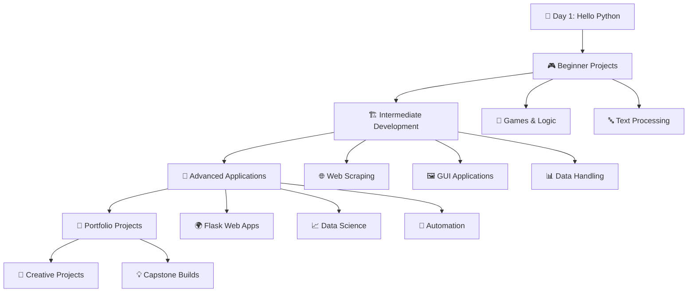

# 🐍 100 Days of Python Pro Bootcamp

<div align="center">


**🚀 A 100-day journey of Python mastery, from zero to hero**

*Transform your coding skills with real-world projects and hands-on learning*

[](https://github.com/AvinashNegi1999/100-Days-of-Python-Pro-Bootcamp/stargazers)
[](https://github.com/AvinashNegi1999/100-Days-of-Python-Pro-Bootcamp/network/members)

</div>

---

## 🎯 **Mission Statement**

> **"Code every day, build every project, master every concept"**
> 
> This repository chronicles my complete transformation through Dr. Angela Yu's legendary Python Bootcamp - from writing my first `print("Hello World!")` to deploying full-stack web applications.

---

## 🌟 **What Makes This Journey Special?**

<table>
<tr>
<td width="50%">

### 🔥 **100% Hands-On Learning**
- **Zero fluff, maximum code**
- Real projects you can showcase
- Daily challenges that build momentum
- Progressive skill development

</td>
<td width="50%">

### 🎨 **Project Diversity**
- **Games & Entertainment Apps**
- **Web Development & APIs**  
- **Data Science & Automation**
- **GUI Applications & Tools**

</td>
</tr>
</table>

---

## 📊 **Learning Path Visualization**



---

## 🗺️ **The Complete Journey Map**

<details>
<summary>📚 <strong>BEGINNER PYTHON</strong> (Days 1-14) - Foundation Building</summary>

### 🎯 **Getting Started with Python**
| Day | 🎨 Project | 🧠 Core Concept | 🔗 Link |
|-----|-----------|----------------|---------|
| 1 | **Band Name Generator** | Variables & Input | [📁](./Day%20001) |
| 2 | **Tip Calculator** | Data Types & Math | [📁](./Day%20002) |
| 3 | **Treasure Island** | Control Flow | [📁](./Day%20003) |
| 4 | **Rock Paper Scissors** | Lists & Randomization | [📁](./Day%20004) |

### 🔄 **Logic & Control Structures**  
| Day | 🎨 Project | 🧠 Core Concept | 🔗 Link |
|-----|-----------|----------------|---------|
| 5 | **Password Generator** | Loops & Security | [📁](./Day%20005) |
| 6 | **Escaping the Maze** | Functions & Logic | [📁](./Day%20006) |
| 7 | **Hangman Game** | Flow Control | [📁](./Day%20007) |
| 8 | **Caesar Cipher** | Parameters & Cryptography | [📁](./Day%20008) |

### 🗂️ **Data Structures & Scope**
| Day | 🎨 Project | 🧠 Core Concept | 🔗 Link |
|-----|-----------|----------------|---------|
| 9 | **Secret Auction** | Dictionaries | [📁](./Day%20009) |
| 10 | **Calculator App** | Functions & Recursion | [📁](./Day%20010) |
| 11 | **Blackjack Game** | List Methods | [📁](./Day%20011) |
| 12 | **Number Guessing** | Scope & Global Variables | [📁](./Day%20012) |
| 13 | **Debugging Master** | Error Handling | [📁](./Day%20013) |
| 14 | **Higher Lower Game** | Data Processing | [📁](./Day%20014) |

</details>

<details>
<summary>⚡ <strong>INTERMEDIATE PYTHON</strong> (Days 15-58) - Skill Expansion</summary>

### 🏗️ **Object-Oriented Programming & Graphics**
| Day | 🎨 Project | 🧠 Core Concept | 🔗 Link |
|-----|-----------|----------------|---------|
| 15 | **Coffee Machine** | OOP Foundations | [📁](./Day%20015) |
| 16 | **OOP Coffee Machine** | Classes & Objects | [📁](./Day%20016) |
| 17 | **Quiz Game** | Class Design | [📁](./Day%20017) |
| 18 | **Hirst Painting** | Turtle Graphics | [📁](./Day%20018) |
| 19 | **Etch-a-Sketch** | Event Listeners | [📁](./Day%20019) |
| 20-21 | **Snake Game** | Inheritance & Game Development | [📁](./Day%20020) |
| 22 | **Pong Game** | Collision Detection | [📁](./Day%20022) |
| 23 | **Turtle Crossing** | Capstone Game Project | [📁](./Day%20023) |

### 📁 **Files, Data & GUI Development**
| Day | 🎨 Project | 🧠 Core Concept | 🔗 Link |
|-----|-----------|----------------|---------|
| 24 | **Mail Merge** | File I/O Operations | [📁](./Day%20024) |
| 25 | **US States Game** | CSV & Data Analysis | [📁](./Day%20025) |
| 26 | **NATO Alphabet** | List/Dict Comprehensions | [📁](./Day%20026) |
| 27 | **Mile to Km Converter** | Tkinter GUI | [📁](./Day%20027) |
| 28 | **Pomodoro Timer** | Dynamic UI & Math | [📁](./Day%20028) |
| 29-30 | **Password Manager** | JSON & Exception Handling | [📁](./Day%20029) |

### 🌐 **APIs, Web Scraping & Automation**
| Day | 🎨 Project | 🧠 Core Concept | 🔗 Link |
|-----|-----------|----------------|---------|
| 31 | **Flash Card App** | Capstone GUI Project | [📁](./Day%20031) |
| 32 | **Birthday Emailer** | SMTP & Email Automation | [📁](./Day%20032) |
| 33 | **ISS Tracker** | API Requests | [📁](./Day%20033) |
| 34 | **Trivia Quiz GUI** | API Integration | [📁](./Day%20034) |
| 35 | **Rain Alert** | Weather API & SMS | [📁](./Day%20035) |
| 36 | **Stock Alert** | Financial APIs | [📁](./Day%20036) |
| 37 | **Habit Tracker** | Pixel API & HTTP | [📁](./Day%20037) |
| 38 | **Exercise Tracker** | Natural Language APIs | [📁](./Day%20038) |
| 39-40 | **Flight Deal Finder** | Complex API Workflows | [📁](./Day%20039) |
| 45 | **Web Scraper** | Beautiful Soup | [📁](./Day%20045) |
| 46 | **Spotify Playlist** | Web Scraping + API | [📁](./Day%20046) |
| 47 | **Amazon Price Tracker** | Selenium Automation | [📁](./Day%20047) |
| 48 | **Cookie Clicker Bot** | Browser Automation | [📁](./Day%20048) |

</details>

<details>
<summary>🚀 <strong>ADVANCED PYTHON</strong> (Days 59-80) - Professional Development</summary>

### 🌍 **Full-Stack Web Development**
| Day | 🎨 Project | 🧠 Core Concept | 🔗 Link |
|-----|-----------|----------------|---------|
| 54 | **Hello Flask** | Web Framework Intro | [📁](./Day%20054) |
| 55 | **Higher/Lower URLs** | URL Routing | [📁](./Day%20055) |
| 56 | **Personal Site** | HTML Templating | [📁](./Day%20056) |
| 57 | **Blog Templating** | Jinja2 & Dynamic Content | [📁](./Day%20057) |
| 58 | **Bootstrap Blog** | CSS Frameworks | [📁](./Day%20058) |
| 59 | **Upgraded Blog** | Advanced Templating | [📁](./Day%20059) |
| 60 | **Contact Form** | POST Requests | [📁](./Day%20060) |
| 61 | **Flask Secrets** | WTForms & Validation | [📁](./Day%20061) |
| 62 | **Coffee & WiFi** | Flask Application | [📁](./Day%20062) |
| 63 | **Library Database** | SQLite Integration | [📁](./Day%20063) |
| 64 | **Movie Database** | CRUD Operations | [📁](./Day%20064) |
| 66 | **Cafe API** | RESTful APIs | [📁](./Day%20066) |
| 67 | **Blog with Users** | Relational Databases | [📁](./Day%20067) |
| 68 | **Flask Authentication** | User Management | [📁](./Day%20068) |
| 69 | **Blog with Users** | Complete Auth System | [📁](./Day%20069) |
| 70 | **Git/GitHub/Deployment** | Version Control & Heroku | [📁](./Day%20070) |

### 📊 **Data Science & Analysis**
| Day | 🎨 Project | 🧠 Core Concept | 🔗 Link |
|-----|-----------|----------------|---------|
| 71 | **College Major Analysis** | Pandas Introduction | [📁](./Day%20071) |
| 72 | **Programming Languages** | Data Visualization | [📁](./Day%20072) |
| 73 | **Lego Dataset** | Aggregate Functions | [📁](./Day%20073) |
| 74 | **Google Trends** | Time Series Analysis | [📁](./Day%20074) |
| 75 | **App Store Analysis** | Advanced Pandas | [📁](./Day%20075) |
| 76 | **Android App Market** | Plotly & Seaborn | [📁](./Day%20076) |
| 77 | **Movie Budget Analysis** | Correlation & Regression | [📁](./Day%20077) |
| 78 | **Nobel Prize Analysis** | Data Exploration | [📁](./Day%20078) |
| 79 | **Tragic Discovery** | Scientific Data Analysis | [📁](./Day%20079) |
| 80 | **Multivariable Regression** | Machine Learning Intro | [📁](./Day%20080) |

</details>

<details>
<summary>💼 <strong>PORTFOLIO PROJECTS</strong> (Days 81-100) - Professional Showcase</summary>

### 🎨 **Creative & Utility Applications**
| Day | 🎨 Project | 🧠 Core Concept | 🔗 Link |
|-----|-----------|----------------|---------|
| 81 | **Text to Morse Code** | String Manipulation | [📁](./Day%20081) |
| 82 | **Portfolio Website** | Professional Showcase | [📁](./Day%20082) |
| 83 | **Tic Tac Toe** | Game Logic | [📁](./Day%20083) |
| 84 | **Image Watermarker** | PIL & Image Processing | [📁](./Day%20084) |
| 85 | **Typing Speed Test** | Real-time Applications | [📁](./Day%20085) |
| 86 | **Breakout Game** | Advanced Game Dev | [📁](./Day%20086) |
| 87 | **Cafe & WiFi Website** | Full-stack Integration | [📁](./Day%20087) |
| 88 | **To-Do List** | Task Management | [📁](./Day%20088) |
| 89 | **Disappearing Text** | Creative Applications | [📁](./Day%20089) |
| 90 | **PDF to Audio** | File Conversion | [📁](./Day%20090) |

### 🏆 **Advanced Portfolio Projects**
| Day | 🎨 Project | 🧠 Core Concept | 🔗 Link |
|-----|-----------|----------------|---------|
| 91 | **Image Color Palette** | Computer Vision | [📁](./Day%20091) |
| 92 | **Custom Web Scraper** | Advanced Automation | [📁](./Day%20092) |
| 93 | **Automated Job Applications** | Career Automation | [📁](./Day%20093) |
| 94 | **Space Invaders** | Complex Game Development | [📁](./Day%20094) |
| 95 | **Custom API** | Backend Development | [📁](./Day%20095) |
| 96 | **Online Shop** | E-commerce Platform | [📁](./Day%20096) |
| 97 | **Custom Automation** | Workflow Optimization | [📁](./Day%20097) |

### 🎯 **Capstone Mastery**
| Day | 🎨 Project | 🧠 Core Concept | 🔗 Link |
|-----|-----------|----------------|---------|
| 98-100 | **Final Capstone Projects** | Full-Stack Mastery | [📁](./Day%20098) |

</details>

---

## 🛠️ **Tech Stack & Tools Mastered**

<div align="center">

### **Core Technologies**


### **Libraries & Frameworks**


### **Development Tools**


</div>

---

## 📈 **Progress Stats**

<div align="center">

| 🎯 **Metric** | 📊 **Achievement** |
|:-------------|:-------------------|
| **Days Completed** | 100/100 ✅ |
| **Projects Built** | 100+ 🚀 |
| **Lines of Code** | 10,000+ 💻 |
| **Technologies Learned** | 15+ 🛠️ |
| **Concepts Mastered** | 50+ 🧠 |

### **Skills Acquired**

```python
class PythonDeveloper:
    def __init__(self):
        self.skills = {
            'frontend': ['HTML', 'CSS', 'Bootstrap', 'Jinja2'],
            'backend': ['Python', 'Flask', 'SQLite', 'REST APIs'],
            'data_science': ['Pandas', 'NumPy', 'Matplotlib', 'Plotly'],
            'automation': ['Selenium', 'Beautiful Soup', 'Requests'],
            'gui': ['Tkinter', 'Turtle Graphics'],
            'tools': ['Git', 'GitHub', 'PyCharm', 'Heroku']
        }
    
    def get_confidence_level(self):
        return "🚀 Ready to build anything!"
```

</div>

---

## 🌟 **Featured Project Highlights**

<table>
<tr>
<td width="33%">

### 🐍 **Snake Game**


**Technologies:** Python, Turtle Graphics  
**Features:** Collision detection, Score tracking, Game states  
**Highlight:** Classic arcade game with modern Python OOP

</td>
<td width="33%">

### 🌍 **Flask Blog Website**  


**Technologies:** Flask, SQLite, HTML/CSS  
**Features:** User authentication, CRUD operations, Admin panel  
**Highlight:** Professional-grade blog platform

</td>
<td width="33%">

### 📊 **Data Analysis Suite**


**Technologies:** Pandas, Matplotlib, Plotly  
**Features:** Statistical analysis, Data visualization, Insights  
**Highlight:** Real-world dataset analysis

</td>
</tr>
</table>

---

## 🎓 **Learning Outcomes**

> **After 100 days, I can confidently:**

<div align="left">

✅ **Build full-stack web applications** with Flask, databases, and authentication  
✅ **Create data science projects** with pandas, visualization, and analysis  
✅ **Develop GUI applications** with Tkinter and modern interfaces  
✅ **Automate workflows** using web scraping, APIs, and browser automation  
✅ **Design games and interactive apps** with proper OOP principles  
✅ **Deploy applications** to cloud platforms like Heroku  
✅ **Work with APIs** for real-world data integration  
✅ **Handle databases** with SQLite and data persistence  
✅ **Write clean, maintainable code** following Python best practices  
✅ **Debug and test applications** with confidence

</div>

---

## 🚀 **Getting Started**

### **Prerequisites**
```bash
# Python 3.8+
python --version

# Git for version control
git --version
```

### **Quick Setup**
```bash
# Clone this repository
git clone https://github.com/AvinashNegi1999/100-Days-of-Python-Pro-Bootcamp.git

# Navigate to project directory
cd 100-Days-of-Python-Pro-Bootcamp

# Explore any day's project
cd "Day 001"
python main.py
```

### **Recommended IDE Setup**
- **PyCharm Professional** (Free for students)
- **VS Code** with Python extensions
- **Replit** for browser-based coding

---

## 💡 **Pro Tips for Success**

<table>
<tr>
<td width="50%">

### 🎯 **Consistency is Key**
- Code every single day, even if just 30 minutes
- Don't skip days - momentum is everything
- Use GitHub to track your progress visually

### 🧠 **Active Learning**
- Don't just copy code - understand every line
- Experiment with modifications and improvements
- Build projects beyond the course requirements

</td>
<td width="50%">

### 🤝 **Community & Support**
- Join Python Discord communities
- Share your daily progress on social media
- Help others and ask questions when stuck

### 🔥 **Level Up Your Projects**
- Add your own features to course projects
- Combine concepts from different days
- Create a portfolio website to showcase work

</td>
</tr>
</table>

---

## 📞 **Connect & Collaborate**

<div align="center">

[](https://github.com/AvinashNegi1999)
[](https://linkedin.com/in/avinash-negi1999)
[](https://twitter.com/avinash_negi99)

**📍 Location:** Uttarakhand, India  
**🎯 Status:** Python Developer | Open to Opportunities  
**💼 Portfolio:** [View My Work](https://github.com/AvinashNegi1999)

</div>

---

## 🙏 **Acknowledgments**

**Huge thanks to:**
- **Dr. Angela Yu** for creating this incredible bootcamp
- **Udemy** for providing an excellent learning platform  
- **Python Community** for continuous inspiration and support
- **Fellow learners** who shared this journey

---

## ⭐ **Support This Journey**

If this repository helped you on your Python journey:

1. **⭐ Star this repository** to show your support
2. **🔀 Fork it** to create your own version  
3. **📢 Share it** with aspiring Python developers
4. **👥 Follow me** for more coding adventures

<div align="center">

**Made with ❤️ and lots of ☕ by [Avinash Negi](https://github.com/AvinashNegi1999)**

*"The best time to plant a tree was 20 years ago. The second best time is now."*  
*Start your 100-day Python journey today! 🚀*

</div>

---

<div align="center">


**© 2024 | 100 Days of Python Pro Bootcamp | All Rights Reserved**

</div>
